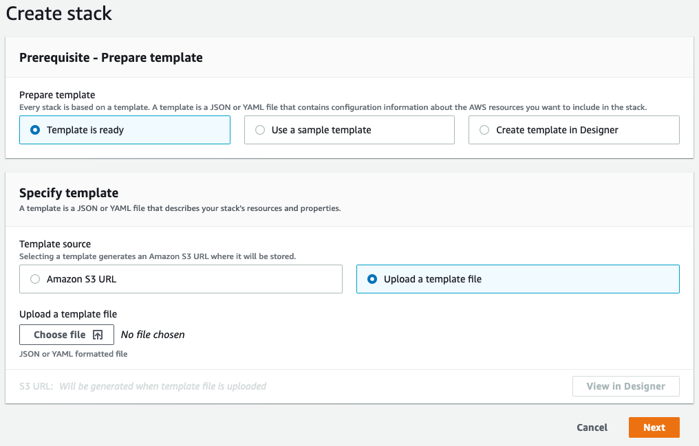

# Using the Sentence Pairs Direct Assessment Tool

To use the tool a database and client need to be set up as well as credentials to allow the client to connect to the database

## Database set up

The database used to store data is [DynamoDB](https://aws.amazon.com/dynamodb/). This is an AWS service to the database will need to be created in AWS https://aws.amazon.com/.

### Create Databases

1. Create an AWS account
2. The [Cloudformation](https://aws.amazon.com/cloudformation/) service can be used to create all tables needed by the client. The 'create stack' feature needs to be used and `Upload a template file` should be used to specify the infrastructure for the databases. The template is provided in  [infrastructure/templates/dynamoDB.json](../infrastructure/templates/dynamoDB.json). The default values can be used.



The cloudformation step will create the relevant DynamoDB tables in AWS.

### Create Database Credentials

In order to allow client to access the DynamoDB database an [access key](https://aws.amazon.com/premiumsupport/knowledge-center/create-access-key/) is required. An access key is made up of an Access Key Id and Secret Access Key. To do create this an AWS [IAM User](https://docs.aws.amazon.com/IAM/latest/UserGuide/introduction_identity-management.html) must also be created. This can be done using a provided cloudformation template

1. Use the same AWS account that the Databases were created in
2. The [Cloudformation](https://aws.amazon.com/cloudformation/) service can be used to create an Access Key Id and Secret Access Key. The 'create stack' feature needs to be used and `Upload a template file` should be used to specify the infrastructure for the databases. The template is provided in [infrastructure/templates/IAM.json](../infrastructure/templates/IAM.json). A password needs to be provided The password will allow an individual to log into AWS via the [AWS Console](https://aws.amazon.com/console/) with the IAM username `DynamoDBAccess` and the password specified.
3. The output tab will show the Access Key Id and Secret Access Key (note the credentials shown in the image below are not valid)


## Setting up the Client 

The client app is available as a Docker image from [https://hub.docker.com/r/newslabsgourmet/direct-assessment-sentence-pair-tool](https://hub.docker.com/r/newslabsgourmet/direct-assessment-sentence-pair-tool)

1. Pull the image using 

```docker pull newslabsgourmet/direct-assessment-sentence-pair-tool```

2. Use the Docker run to start a container from the image

```docker run -p 8080:8080 -e AWS_ACCESS_KEY_ID=AWS_KEY_ID -e AWS_SECRET_ACCESS_KEY=AWS_SECRET_ACCESS_KEY newslabsgourmet/direct-assessment-sentence-pair-tool```

There are multiple parameters that need to be provided to the run command:

* -p 8080:8080 This exposes the application on port 8080
* -e AWS_ACCESS_KEY_ID=AWS_KEY_ID Provide the secret access key ID created when creating DynamoDB credentials
* -e AWS_SECRET_ACCESS_KEY=AWS_SECRET_ACCESS_KEY Provide the secret access key created when creating DynamoDB credentials

3. The Sentence Pairs Direct Assessment App will now be running on [http://localhost:8080](http:localhost:8080) using the DynamoDB created in AWS for storage.
