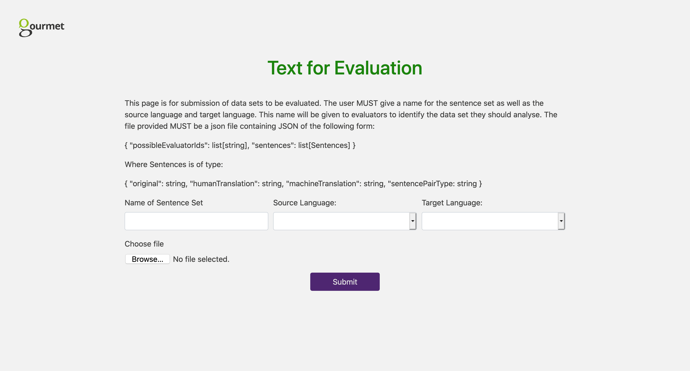
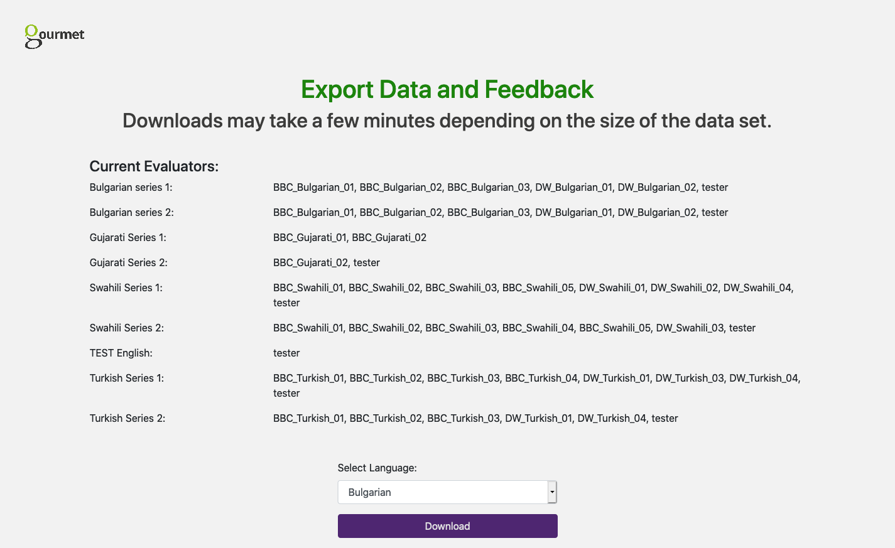

# User Guide

The app has two types of user 

- Evaluation Coordinators: Individuals running the evaluation. They are responsible for providing the data sets to be evaluated and reviewing the results of the evaluation
- Participants: Individuals completing the Direct Assessment Task

## Evaluation Coordinators

The aspects of the UI relevant to the Evaluation Coordinator are shown on the home page. There is an option to submit data sets and view results


### Creating and Submitting a Data Set

#### Creating Data Sets for the App

The Data set must be a json file with the following structure:

```
{
    "possibleEvaluatorIds": list[string],
    "sentences": list[Sentences]
}
```

Where Sentences have the following properties:

```
{
    "original": string,
    "humanTranslation": string,
    "machineTranslation": string,
    "sentencePairType": string
}
```

For Example:

```json
{
    "possibleEvaluatorIds": ["evaluator1", "evaluator2"],
    "sentences": [
        {
            "original": "Only a few weeks ago, Andrei Vaganov and Yevgeny Yerofeyev had no problem with the Russian authorities.",
            "humanTranslation": "Допреди няколко седмици Андрей Ваганов и Евгений Ерофеев нямали проблеми с руските власти.",
            "machineTranslation": "Само преди няколко седмици Андрей Ваганов и Евгений Йерфеев нямаха проблем с руските власти.",
            "sentencePairType": "A"
        },
        {
            "original": "The couple had married in Denmark and lived with their two adopted sons in Moscow.",
            "humanTranslation": "Двамата се оженили в Дания и заживели с двамата си осиновени синове в Москва.",
            "machineTranslation": "Двойката е омъжена в Дания и живее с двамата си осиновени синове в Москва.",
            "sentencePairType": "A"
        }
    ]
}
```

Parts of the data structure:

- possibleEvaluatorIds: A participant will select an evaluator ID when starting the Direct Assessment exercise. This determines the list of evaluator IDs that will be available for a given data set. The Tool will always provide the evaluator ID 'tester'. This is used for testing purposes and should not be used by an actual participant as their scores will not be shown in the results
- sentencePairType: A way to mark sentences of different types. For example if as the Evaluation Coordinator you wanted to introduce some nonsense sentences or perfect translations to use as a benchmark. 

At the BBC data set JSON is generated using the [`randomiseAndFormatData.py`](../scripts/randomiseAndFormatData.py) script. The comments in the [script](../scripts/randomiseAndFormatData.py) document how to use it. The [exampleData directory](../scripts/exampleData) provides examples of input and output. While this script is specific to the way the BBC uses the Direct Assessment Tool for evaluation the script can be adapted and generalised to fit other use cases.

#### Submitting a Data Set

The JSON data set is then uploaded on the 'submit data sets' page



### View Results

The View Results page allows the Evaluation Coordinator to export the Direct Assessment scores by language as a CSV file. It also shows which participants have **started** the Direct Assessment Task.



## Participants

### 1. Starting the Task

Participants will be shown an introduction to the Task


### 2. Selecting a Data Set and Evaluator ID

Participants will select a Set to evaluate and an Evaluator ID


### 3. Direct Assessment Tasks

Participants will be shown a series of sentence pairs to evaluate.


### 4. Feedback

One the participant has viewed all of the sentence pairs they will be asked to provide feedback

